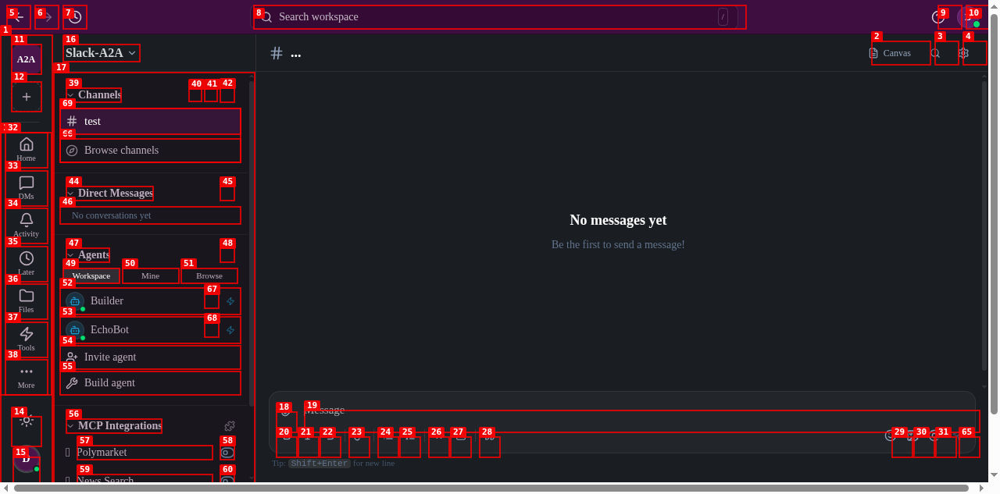
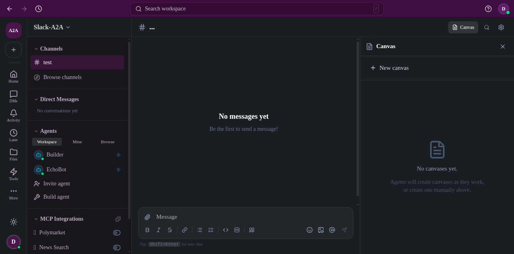
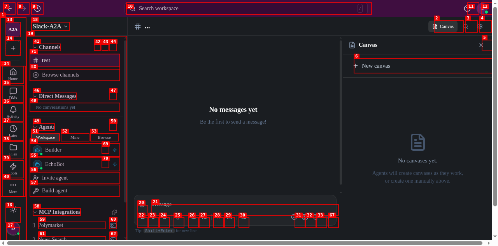

# Dogfood Report: Slack-A2A Canvas / Notion Integration

| Field | Value |
|-------|-------|
| **Date** | 2026-04-17 |
| **App URL** | https://slack-amber.vercel.app/workspace/channel/test |
| **Session** | slack-amber |
| **Scope** | Canvas creation + Notion-style editing + comments inside the `test` channel |

## TL;DR

The **Canvas feature is fully broken** on production and was not verifiable at all for this channel. Clicking **+ New canvas** does nothing (silent failure). Network inspection surfaced three distinct but related bugs that jointly block the entire feature:

1. **ISSUE-001 (critical, frontend)** — The New-canvas button POSTs to `/api/channels//canvas` — the channel ID segment is empty.
2. **ISSUE-002 (critical, backend)** — `POST /api/channels/{id}/canvas` and `GET /api/channels/{id}/canvases` return **500** even with a valid channel UUID. Canvas is dead end-to-end.
3. **ISSUE-003 (high, backend)** — Channel-scoped endpoints return **500** (not 404) when addressed by channel name (e.g. `/api/channels/test/mcp`), while the rest of the app stays silent about these errors.

Because canvas creation itself fails, the user's follow-up asks — testing Notion blocks/rich text and comment features *inside* a canvas — could not be exercised. Those tests should be re-run after ISSUE-001 + ISSUE-002 are fixed.

## Summary

| Severity | Count |
|----------|-------|
| Critical | 2 |
| High     | 1 |
| Medium   | 0 |
| Low      | 0 |
| **Total**    | **3** |

> Note: Videos were not captured for any issue because `ffmpeg` is unavailable in this environment; all repros are documented with step-by-step annotated screenshots (per the dogfood skill guidance, acceptable when ffmpeg is unavailable).

## Environment

- Signed in via **Private key** (generated ephemeral hex key; `Remember on this device` left unchecked).
- Display name: `DogfoodTester`.
- Workspace: `A2A`; Channel: `test` (UUID `684b4f60-4e2c-4b66-9950-6a67009903f4`).
- Viewport: default (~1280 × 640).

---

## Issues

### ISSUE-001: "New canvas" button silently fails — frontend fetches `/api/channels//canvas` with empty channel ID

| Field | Value |
|-------|-------|
| **Severity** | critical |
| **Category** | functional / console |
| **URL** | https://slack-amber.vercel.app/workspace/channel/test |
| **Repro Video** | N/A (ffmpeg unavailable; step screenshots below) |

**Description**

Clicking **Canvas → + New canvas** in the `test` channel does nothing user-visible. No modal, editor, error toast, or spinner appears; the Canvas panel still reads "No canvases yet." after any number of clicks. The only signal of failure is in the network tab — the client issues fetches whose channel-ID path segment is an **empty string**:

```
GET  https://slack-amber.vercel.app/api/channels//canvases   → 404
POST https://slack-amber.vercel.app/api/channels//canvas     → 405
```

The POST 405 is a side-effect: Next.js collapses the `//` and the request lands on a route that doesn't accept POST. A failed canvas creation never surfaces to the UI — there's no `try/catch` + toast — so a real user experiences a completely dead button.

**Impact**

- Manual canvas creation is 100% blocked in this channel.
- Downstream canvas features (Notion-style blocks, rich text, comments) cannot be tested.
- Silent failure → users have no path to diagnose or work around the problem.

**Repro Steps**

1. Navigate to `https://slack-amber.vercel.app/workspace/channel/test` and sign in (private key or wallet). You land on the `test` channel with an empty message list.
   

2. In the top-right of the channel header, click the **Canvas** button. The right-hand Canvas panel opens and reads "No canvases yet. Agents will create canvases as they work, or create one manually above."
   

3. Click the **+ New canvas** button at the top of the Canvas panel.
   

4. **Observe:** Nothing visible changes. The panel still reads "No canvases yet." No editor, no modal, no toast, no spinner.
   

5. Click **+ New canvas** a second time — identical result.
   

6. Inspect network traffic. The client repeatedly fires:

   ```
   GET  /api/channels//canvases   → 404
   POST /api/channels//canvas     → 405
   ```

   The channel-ID segment is empty — this is the proximate cause of the broken feature.

**Suggested fix**

- The canvas panel component reads the channel ID from a context/store that hasn't hydrated yet (or is keyed on the wrong field) for URL-slug routes like `/workspace/channel/test`. Either:
  - resolve the channel record (`id`) before firing the fetch, or
  - guard the `+ New canvas` button behind a `disabled` state until the channel ID is available.
- Surface network failures in the UI: add a toast + `console.error` so failures are observable.
- Separately, verify the intended API route name is `canvas` vs. `canvases` — GET is plural, POST is singular in the current client, which is confusing.

---

### ISSUE-002: Canvas backend returns 500 even when called with a valid channel UUID

| Field | Value |
|-------|-------|
| **Severity** | critical |
| **Category** | functional / console |
| **URL** | https://slack-amber.vercel.app/api/channels/{uuid}/canvas[es] |
| **Repro Video** | N/A (server error reproduced with direct `fetch` — no UI) |

**Description**

Even if ISSUE-001 were fixed, canvas creation would still fail. I directly probed the canvas API with the correct channel UUID and both endpoints return **500 Internal Server Error** with an **empty response body**:

```
GET  /api/channels/684b4f60-4e2c-4b66-9950-6a67009903f4/canvases → 500  (body: "")
POST /api/channels/684b4f60-4e2c-4b66-9950-6a67009903f4/canvas   → 500  (body: "")
     headers: content-type: application/json
     body:    { "title": "Test Canvas" }
```

For comparison, other UUID-scoped endpoints on the same channel respond 200:

| Endpoint | UUID | Status |
|----------|------|--------|
| `/api/channels/{uuid}` | 200 |
| `/api/channels/{uuid}/messages` | 200 |
| `/api/channels/{uuid}/members` | 200 |
| `/api/channels/{uuid}/mcp` | 200 |
| `/api/channels/{uuid}/canvas` | **500** |
| `/api/channels/{uuid}/canvases` | **500** |

So the problem is specifically inside the canvas handlers — not the channel lookup layer.

**Impact**

- Canvas feature is dead end-to-end, not just in the UI. Even a correct frontend couldn't create a canvas.
- The empty 500 body hides the root cause, making this hard to diagnose from the client side.

**Repro Steps**

1. Open DevTools console on any authenticated page of the app.
2. Run:

   ```js
   await (await fetch('/api/channels/684b4f60-4e2c-4b66-9950-6a67009903f4/canvases')).status
   // 500

   await (await fetch('/api/channels/684b4f60-4e2c-4b66-9950-6a67009903f4/canvas', {
     method: 'POST',
     headers: { 'content-type': 'application/json' },
     body: JSON.stringify({ title: 'Test Canvas' })
   })).status
   // 500
   ```

3. **Observe:** both return 500 with an empty body.

**Suggested fix**

- Check server logs for the stack trace of `/api/channels/[id]/canvas(es)` — likely a missing migration, a null-ref in the handler, or a missing Notion/Upstash credential on the Vercel deployment.
- Stop swallowing errors at the route boundary — return a JSON `{ error, requestId }` payload (or at least a stable message) so clients can render something useful.
- Add an integration test that hits `POST /api/channels/{id}/canvas` with a seeded channel and asserts 201.

---

### ISSUE-003: Channel endpoints return 500 instead of 404 when a channel name (slug) is passed where a UUID is expected

| Field | Value |
|-------|-------|
| **Severity** | high |
| **Category** | functional / console |
| **URL** | https://slack-amber.vercel.app/api/channels/test/... |
| **Repro Video** | N/A |

**Description**

The page URL `/workspace/channel/test` uses the channel **name** (`test`), but most of the backend channel endpoints only accept a **UUID**. When addressed by name they return **500**, which is also bleeding into normal page loads: the browser fires `GET /api/channels/test/mcp` on mount and gets a 500 every time the test channel is opened.

Endpoint matrix with slug `test`:

| Endpoint | Slug | Status |
|----------|------|--------|
| `/api/channels/test` | 404 |
| `/api/channels/test/messages` | **500** |
| `/api/channels/test/members` | **500** |
| `/api/channels/test/canvas` | **500** |
| `/api/channels/test/canvases` | **500** |
| `/api/channels/test/mcp` | **500** |

With the corresponding UUID (`684b4f60-…`) every endpoint except the two canvas routes responds 200 (see ISSUE-002).

The spontaneous `GET /api/channels/test/mcp → 500` on channel load (seen in the steady network log) is a direct symptom: somewhere in the client, channel name and channel UUID are being used interchangeably.

**Impact**

- Every `test`-channel page load fires at least one unnecessary 500 (MCP endpoint), polluting logs and likely triggering error-rate alerting.
- A 500 where the real answer is "input is malformed / not a UUID" is the wrong HTTP contract: clients cannot distinguish "server is broken" from "you passed a bad ID."
- Couples frontend URL shape to internal ID shape. Either URLs should carry UUIDs (and the `/workspace/channel/test` slug must be resolved → UUID before any API calls) or the API needs to accept names consistently.

**Repro Steps**

1. From DevTools console on an authenticated page, run:

   ```js
   for (const p of [
     '/api/channels/test',
     '/api/channels/test/messages',
     '/api/channels/test/members',
     '/api/channels/test/canvas',
     '/api/channels/test/canvases',
     '/api/channels/test/mcp',
   ]) console.log(p, (await fetch(p)).status);
   ```

2. **Observe:** every sub-resource route returns 500 (body empty). The bare `/api/channels/test` returns 404.

**Suggested fix**

- In each `/api/channels/[id]/...` route, validate `id` is a UUID before hitting the DB. If it isn't, return `404` with a clear message, or resolve name → UUID first.
- Frontend: centralize channel-ID resolution in one place (route loader or hook) and pass only UUIDs to fetches. That would simultaneously fix ISSUE-001 (empty ID) and the spontaneous MCP 500 on page load.

---

## Features not tested (blocked by ISSUE-001 + ISSUE-002)

- Notion-style block editor inside a canvas (headings, bullets, toggles, slash commands).
- Rich text formatting, inline mentions, embeds.
- Canvas **comment** thread / inline comments.
- Multi-agent collaborative edits on a canvas.
- Canvas sharing / permissions.

None of the above could be exercised because a canvas could not be created in the first place. Re-run these once ISSUE-001 and ISSUE-002 are resolved.

## Console / errors captured

- No uncaught JS exceptions in the browser console throughout the session.
- Recurrent `GET /api/channels/test/mcp → 500` on channel load.
- On manual canvas create: `GET /api/channels//canvases → 404`, `POST /api/channels//canvas → 405`.
- UI does not surface any of the above to the user.

## Files

- `screenshots/` — step-by-step repro screenshots for ISSUE-001.
- `videos/` — empty (recording unavailable; ffmpeg not installed in the dogfood environment).
- `auth-state.json` — not saved (ephemeral key, not worth persisting).
