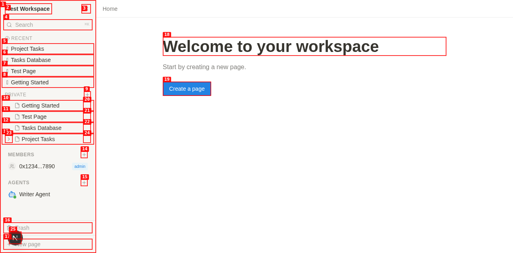
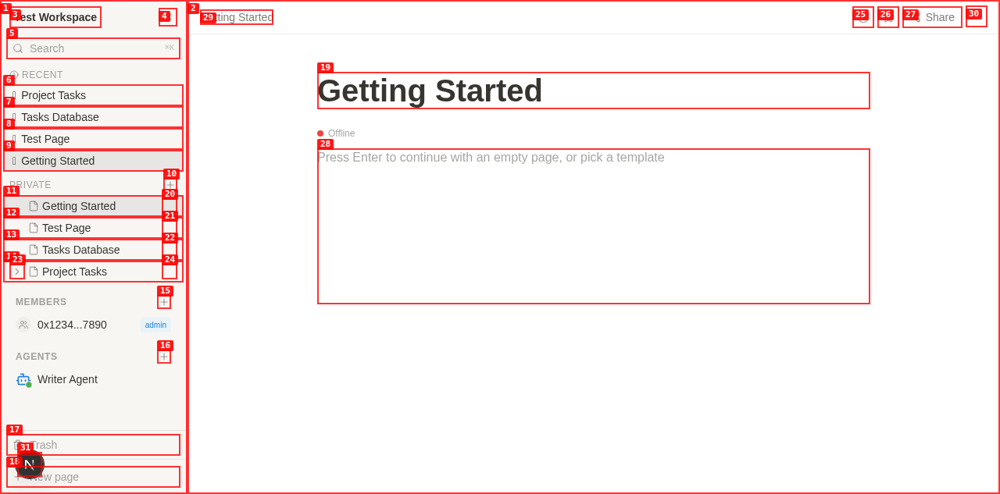
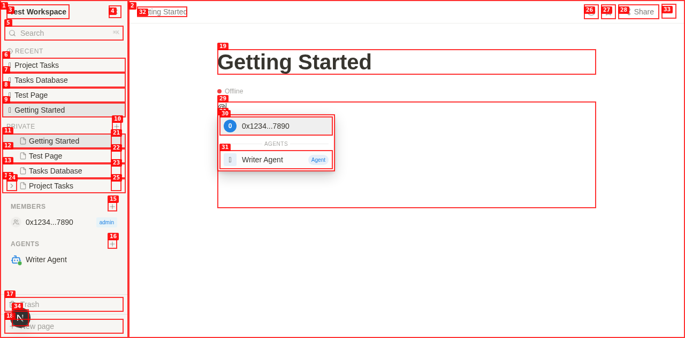
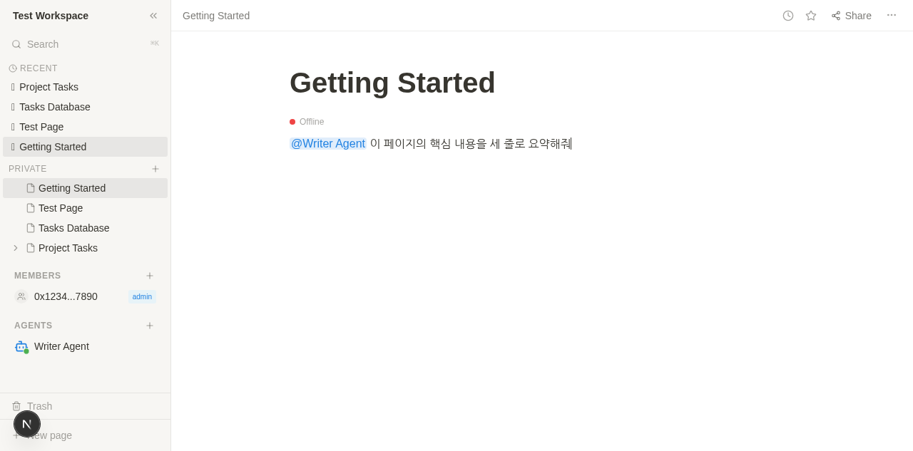
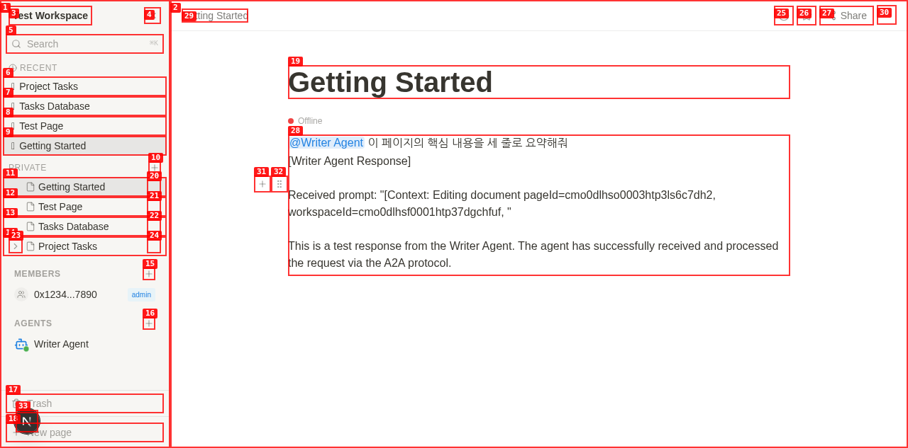

# Dogfood Report: A2A Userflow — Notion Clone

| Field | Value |
|-------|-------|
| **Date** | 2026-04-16 |
| **App URL** | http://localhost:3010 |
| **Session** | a2a-userflow |
| **Scope** | A2A 기능 전체 플로우 (a2a-userflow.md 기반) |

## Summary

| Severity | Count |
|----------|-------|
| Critical | 0 |
| High | 3 |
| Medium | 2 |
| Low | 0 |
| **Total** | **5** |

## Flows 테스트 결과

| Flow | 제목 | 결과 |
|------|------|------|
| Flow 1.1 | Add Agent 모달 열기 | ✅ 정상 |
| Flow 1.2 | Agent URL 프리뷰 | ✅ 정상 (유효 URL), ✅ 오류 처리 정상 |
| Flow 1.3 | 에이전트 등록 | ✅ 정상 (사이드바 AGENTS 섹션에 표시) |
| Flow 2.1 | 문서 열기 / 편집기 연결 | ⚠️ Offline 상태 (ISSUE-002) |
| Flow 2.2 | @ 멘션 드롭다운 | ✅ 정상 (Members + Agents 구분 표시) |
| Flow 2.3 | 프롬프트 입력 | ✅ 정상 |
| Flow 2.4 | Enter로 에이전트 호출 | ⚠️ 응답 삽입됨, 단 타이핑 인디케이터 없음 (ISSUE-003) |
| Flow 3.1 | 타이핑 인디케이터 | ❌ 미구현 (ISSUE-003) |
| Flow 3.2 | 응답 삽입 | ⚠️ 삽입됨, 단 프롬프트 내용 누락 (ISSUE-004) |
| Flow 5.1 | 헬스 체크 (UI) | ❌ 사이드바 에이전트 항목이 비인터랙티브 (ISSUE-001) |
| Flow 5.2 | 스킬 확인 (UI) | ❌ 사이드바 에이전트 항목이 비인터랙티브 (ISSUE-001) |
| Flow 5.3 | 에이전트 제거 (UI) | ❌ 사이드바 에이전트 항목이 비인터랙티브 (ISSUE-001) |
| Flow 6.1 | 사람 멘션 (invoke 미트리거) | ✅ 정상 |
| API: health | POST /agents/:id/health | ✅ 정상 |
| API: skills | GET /agents/:id/skills | ✅ 정상 |
| API: invoke | POST /agents/invoke | ⚠️ 프롬프트 누락 (ISSUE-004) |
| API: stream | POST /agents/invoke?stream=true | ✅ SSE 스트리밍 정상 |
| API: mention | GET /mentions/suggest | ⚠️ type 없이 호출 시 agents 제외 (ISSUE-005) |

---

## Issues

### ISSUE-001: 사이드바 에이전트 항목에 인터랙티브 컨트롤 없음

| Field | Value |
|-------|-------|
| **Severity** | high |
| **Category** | functional |
| **URL** | http://localhost:3010 |
| **Repro Video** | N/A (ffmpeg 미설치) |

**Description**

사이드바 AGENTS 섹션에 에이전트가 등록되면 이름만 텍스트로 표시되고, 어떤 상호작용도 불가능하다.
a2a-userflow.md의 Flow 5 (에이전트 상태 및 관리) 전체가 UI에서 미구현 상태이다.

- **Flow 5.1 (Check Status)**: 에이전트 항목에 컨텍스트 메뉴가 없음 → "Check Status" 선택 불가
- **Flow 5.2 (Skills 확인)**: 에이전트 항목 클릭 시 스킬 목록 조회 불가 (아무 반응 없음)
- **Flow 5.3 (에이전트 제거)**: hover 시 × 버튼이 나타나지 않음

spec에서 요구하는 동작:
> "사이드바 에이전트 항목 hover 시 나타나는 × 버튼 클릭 → DELETE /api/v1/agents/:id"
> "에이전트 항목에서 컨텍스트 메뉴 열어 Check Status 선택 → POST /api/v1/agents/:id/health"
> "에이전트 항목 클릭 시 GET /api/v1/agents/:id/skills로 스킬 목록 조회"

API 엔드포인트 자체는 정상 작동함 (health, skills, delete 모두 API로 직접 호출 가능).

**Repro Steps**

1. 워크스페이스 접속 후 AGENTS 섹션에 에이전트가 등록된 상태 확인
   

2. 에이전트 항목 위로 마우스를 올려 hover — × 버튼이 나타나지 않음
   

3. **Observe:** 에이전트 항목을 클릭해도 아무 반응 없음. 컨텍스트 메뉴도 없음. Flow 5 전체가 UI에서 접근 불가.

---

### ISSUE-002: 협업 에디터 연결 상태가 "Offline"으로 표시됨

| Field | Value |
|-------|-------|
| **Severity** | medium |
| **Category** | functional |
| **URL** | http://localhost:3010/workspace/[workspaceId]/[pageId] |
| **Repro Video** | N/A |

**Description**

페이지를 열면 에디터 상단에 빨간 점 + "Offline" 텍스트가 표시된다.
a2a-userflow.md Flow 2.1에서는 "초록 점 + Connected 표시가 뜨면 준비 완료"라고 명시되어 있다.

WebSocket 포트(3012)는 실제로 열려 있지만, Hocuspocus 연결이 Established되지 않아 Offline으로 표시되는 것으로 보인다. 에이전트 응답 삽입은 HTTP 방식으로 동작하여 Offline 상태에서도 작동하지만, 협업 기능(다중 사용자 실시간 편집)은 불가능한 상태이다.

**Repro Steps**

1. 워크스페이스에서 임의 페이지 클릭
2. 에디터가 로드되면 에디터 영역 상단을 확인
   

3. **Observe:** 초록 점 + "Connected" 대신 빨간 점 + "Offline" 표시됨.

---

### ISSUE-003: 에이전트 응답 중 타이핑 인디케이터 미표시

| Field | Value |
|-------|-------|
| **Severity** | high |
| **Category** | ux |
| **URL** | http://localhost:3010/workspace/[workspaceId]/[pageId] |
| **Repro Video** | N/A |

**Description**

`@Writer Agent 요약해줘` + Enter 입력 후 에이전트 호출이 시작되지만, spec에서 요구하는 타이핑 인디케이터가 전혀 표시되지 않는다.

spec 요구사항:
> "에디터 상단에 에이전트 배지가 나타난다: ● My Agent is writing..."
> "배지는 에이전트별 고유 색상으로 구분된다."
> "스트리밍 완료 후 타이핑 인디케이터가 사라진다."

실제 동작: 호출 후 응답이 에디터에 바로 삽입되지만, 그 사이 어떤 로딩/진행 표시도 없어 에이전트가 응답 중인지 알 수 없다. (비스트리밍 방식으로 한 번에 삽입됨)

SSE 스트리밍 API 자체(`?stream=true`)는 정상 작동하지만, 프론트엔드에서 스트리밍 중 타이핑 인디케이터를 렌더링하는 로직이 구현되지 않은 것으로 보인다.

**Repro Steps**

1. 페이지 에디터에서 `@`를 입력하여 멘션 드롭다운 열기
   

2. 에이전트 선택 후 프롬프트 입력 (`이 페이지의 핵심 내용을 세 줄로 요약해줘`)
   

3. Enter 키 누름 — 에디터 상단에 "● Writer Agent is writing..." 배지가 **나타나지 않음**

4. **Observe:** 잠시 후 응답 텍스트가 한 번에 삽입됨. 타이핑 인디케이터 없이 즉시 결과가 나타남.
   

---

### ISSUE-004: 에이전트 invoke 시 사용자 프롬프트 텍스트가 에이전트로 전달되지 않음

| Field | Value |
|-------|-------|
| **Severity** | high |
| **Category** | functional |
| **URL** | POST /api/v1/agents/invoke |
| **Repro Video** | N/A |

**Description**

에이전트를 호출할 때 사용자가 입력한 실제 프롬프트 텍스트가 에이전트에게 전달되지 않는다.

API 직접 테스트 결과:
```
POST /api/v1/agents/invoke
Body: { "agentId": "...", "prompt": "테스트 요약해줘", "pageId": "...", "workspaceId": "..." }
```

에이전트가 받은 내용:
```
Received prompt: "[Context: Editing document pageId=..., workspaceId=...]
"
```

사용자 프롬프트 "테스트 요약해줘"가 완전히 누락되어 있다. 에이전트는 문서 메타데이터(pageId, workspaceId)만 받고 실제 요청 내용을 알 수 없다.

이 버그로 인해 에이전트는 무슨 작업을 해야 할지 알 수 없으며, 실질적인 A2A 기능이 동작하지 않는다.

**Repro Steps**

1. 에이전트 등록 후 invoke API 직접 호출:
   ```bash
   curl -X POST http://localhost:3011/api/v1/agents/invoke \
     -H "Content-Type: application/json" \
     -d '{"agentId": "...", "prompt": "테스트 요약해줘", "pageId": "...", "workspaceId": "..."}'
   ```

2. **Observe:** 응답에서 에이전트가 받은 prompt 내용:
   ```json
   {
     "content": "[Writer Agent Response]\n\nReceived prompt: \"[Context: Editing document pageId=..., workspaceId=...]\n\"\n\nThis is a test response..."
   }
   ```
   사용자가 전송한 "테스트 요약해줘" 텍스트가 누락됨.

3. UI에서도 동일하게 재현:
   
   — 응답 블록에서 `Received prompt` 내용에 실제 사용자 요청 텍스트 없음.

---

### ISSUE-005: 멘션 suggest API가 type 미지정 시 에이전트를 제외함

| Field | Value |
|-------|-------|
| **Severity** | medium |
| **Category** | functional |
| **URL** | GET /api/v1/mentions/suggest |
| **Repro Video** | N/A |

**Description**

멘션 suggest API를 `type` 파라미터 없이 호출하면 에이전트가 결과에 포함되지 않는다.

```bash
# type 미지정 (all members)
GET /api/v1/mentions/suggest?workspace_id=...&q=
→ [{"id": "...", "name": "0x1234...7890"}]  # 에이전트 없음

# type=agent 지정
GET /api/v1/mentions/suggest?type=agent&workspace_id=...&q=
→ [{"id": "...", "name": "Writer Agent", "isAgent": true, ...}]  # 정상
```

프론트엔드가 현재 두 번의 별도 API 호출(members + agents)로 멘션 드롭다운을 구성하고 있어 실제 UI 동작에는 문제가 없지만, type 없이 호출하는 다른 클라이언트나 향후 구현에서 에이전트가 누락될 수 있다.

spec에서 정의한 엔드포인트:
> `GET /api/v1/mentions/suggest?type=agent&...` — agents 전용

전체 멘션(members + agents 통합) 조회 엔드포인트가 없거나, type 미지정 시 agents도 포함되어야 한다.

**Repro Steps**

1. API 직접 호출:
   ```bash
   curl "http://localhost:3011/api/v1/mentions/suggest?workspace_id=...&q=" -H "Cookie: ..."
   ```

2. **Observe:** 응답에 에이전트 없음 — 인간 멤버만 반환됨.

---

## 테스트 범위 요약

### 정상 동작 확인

- **Flow 1 (에이전트 추가)**: URL 입력 → 에이전트 카드 프리뷰 → 등록 → AGENTS 섹션 표시
- **Flow 1 오류 처리**: 유효하지 않은 URL 입력 시 "Failed to fetch agent card" 표시, Add Agent 버튼 비활성 유지
- **Flow 2 멘션 드롭다운**: `@` 입력 시 Members + AGENTS 두 그룹으로 구분 표시, 에이전트 🤖 아이콘 + [Agent] 배지
- **Flow 2/3 에이전트 호출 & 응답 삽입**: @Agent + 프롬프트 + Enter → 응답 텍스트 에디터에 삽입됨
- **Flow 6 (사람 멘션 분리)**: `@human` 멘션 후 Enter 시 invoke 미트리거, 알림 발송 전용으로 작동
- **API: health check**: POST /agents/:id/health → `{"status": "online"}` 정상
- **API: skills**: GET /agents/:id/skills → 스킬 목록 정상 반환
- **API: streaming**: POST /agents/invoke?stream=true → SSE 이벤트 스트리밍 정상 (agent_start + text chunks)

### 미테스트 항목

- **Flow 4 (다중 에이전트 체이닝)**: review 스킬을 가진 두 번째 에이전트가 필요하여 테스트 불가
- **Flow 5.3 DELETE (API)**: 테스트 환경 보존을 위해 직접 삭제 테스트 생략 (UI에서는 ISSUE-001로 불가)
