# Issue Report: Notion Clone Dogfood

| Field | Value |
|-------|-------|
| **Date** | 2026-04-15 |
| **App URL** | http://localhost:3010 (web) / http://localhost:3011 (API) |
| **Session** | notion-localhost |
| **Scope** | userflow.md 전체 플로우 — 워크스페이스 접속, 사용자 초대, A2A 에이전트 등록, @멘션 에이전트 호출, 퍼블리시 |
| **Tester** | Claude Code dogfood |

---

## Summary

| Severity | Count |
|----------|-------|
| Critical | 1 |
| High | 4 |
| Medium | 2 |
| Low | 0 |
| **Total** | **7** |

---

## Issues

---

### ISSUE-001: 로그인/인증 페이지 없음 — 앱이 바로 워크스페이스 생성 화면으로 이동

| Field | Value |
|-------|-------|
| **Severity** | medium |
| **Category** | functional / ux |
| **URL** | http://localhost:3010/ |
| **Repro Video** | N/A |

**Description**

userflow.md Step 1에는 "사용자가 Notion 앱에 로그인한다"는 단계가 있으나, 앱에 접속하면 로그인 화면 없이 바로 "Create your workspace" 화면이 표시된다. 모든 사용자가 동일 세션("Default User / admin")으로 간주되며 실제 인증이 없다. 멤버를 구분하거나 권한을 부여할 수 있는 기반이 부재하다.

**Repro Steps**

1. http://localhost:3010 에 접속한다.
   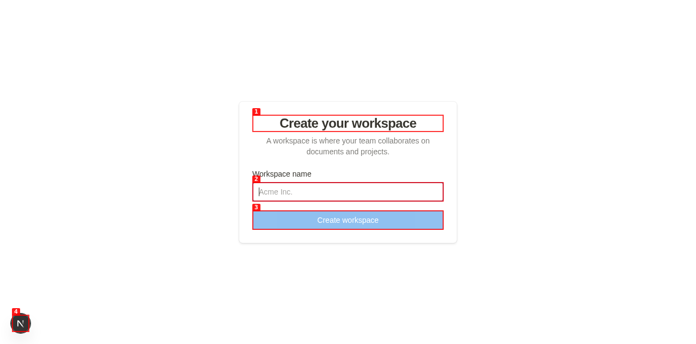

2. **Observe:** 로그인 폼이 없고 "Create your workspace" 워크스페이스 생성 화면이 바로 나타난다.

---

### ISSUE-002: 초대 링크로 워크스페이스 참여 후 MEMBERS 목록에 새 멤버가 나타나지 않음

| Field | Value |
|-------|-------|
| **Severity** | high |
| **Category** | functional |
| **URL** | http://localhost:3010/invite/{token} |
| **Repro Video** | N/A |

**Description**

사이드바 MEMBERS 섹션에서 "Invite Member" 버튼을 클릭하면 초대 링크가 생성된다. 해당 링크로 이동해 "Join Workspace" 버튼을 클릭하면 워크스페이스 화면으로 리디렉션되지만, MEMBERS 목록에는 여전히 "Default User" 한 명만 표시된다. 새 멤버가 추가된 흔적이 없다. userflow.md Step 2.4: "새 멤버가 사이드바 멤버 목록에 나타난다"는 조건을 만족하지 못한다.

**Repro Steps**

1. 워크스페이스에서 "Invite Member" 버튼을 클릭한다.
   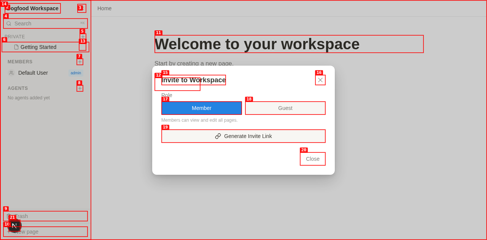

2. "Generate Invite Link"를 클릭해 초대 링크를 생성한다.
   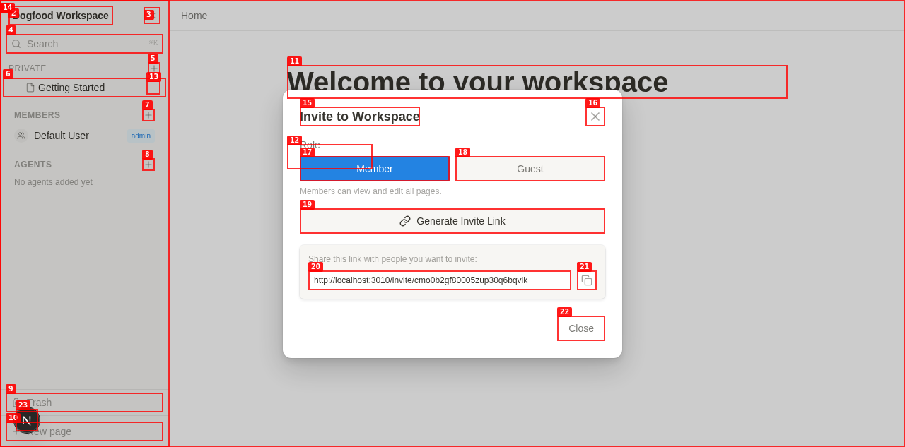

3. 생성된 링크(`http://localhost:3010/invite/...`)로 이동해 "Join Workspace"를 클릭한다.
   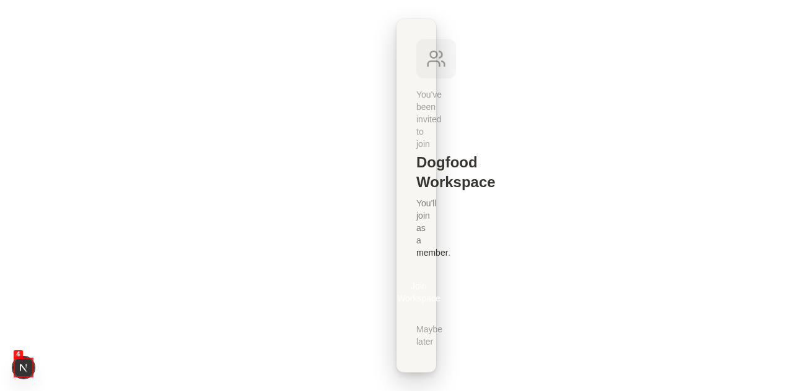

4. **Observe:** 워크스페이스 화면으로 리디렉션되었지만 MEMBERS 목록에 새 멤버가 추가되지 않았다.
   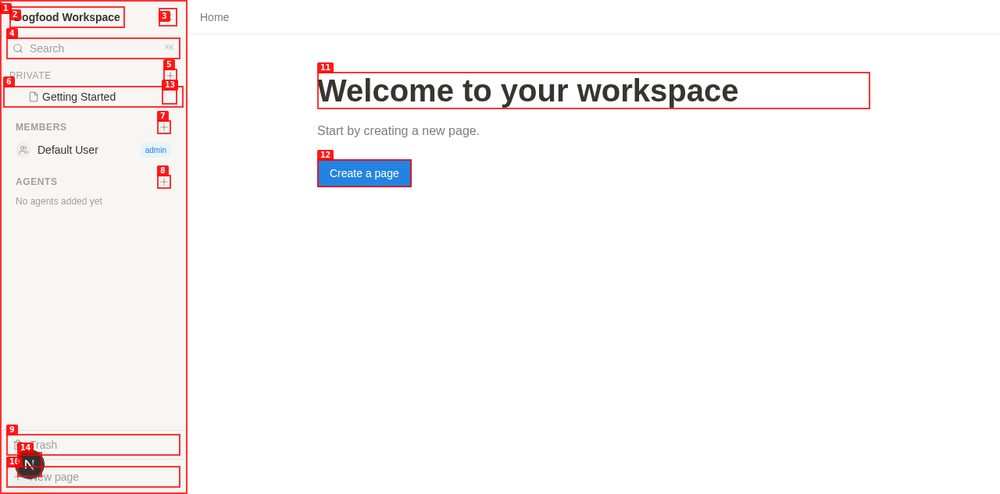

---

### ISSUE-003: @멘션 선택 후 표시 이름 대신 내부 User ID가 에디터에 삽입됨

| Field | Value |
|-------|-------|
| **Severity** | high |
| **Category** | functional / ux |
| **URL** | http://localhost:3010/workspace/{workspaceId}/{pageId} |
| **Repro Video** | N/A |

**Description**

에디터에서 `@`를 입력하면 멘션 드롭다운이 나타나고 "Default User"가 표시된다. 해당 항목을 클릭하면 `@Default User`가 아닌 `@cmnzonbgz0000jpp3cx0uxd9s` (내부 DB Primary Key)가 에디터에 삽입된다. Mention extension의 `renderHTML` 또는 `label` 필드가 name 대신 id를 참조하고 있는 것으로 보인다.

**Repro Steps**

1. 페이지 에디터에서 `@`를 입력한다.

2. 멘션 드롭다운에서 "Default User"를 클릭한다.

3. **Observe:** 에디터에 `@cmnzonbgz0000jpp3cx0uxd9s`가 삽입된다 (파란색 하이퍼링크 스타일).
   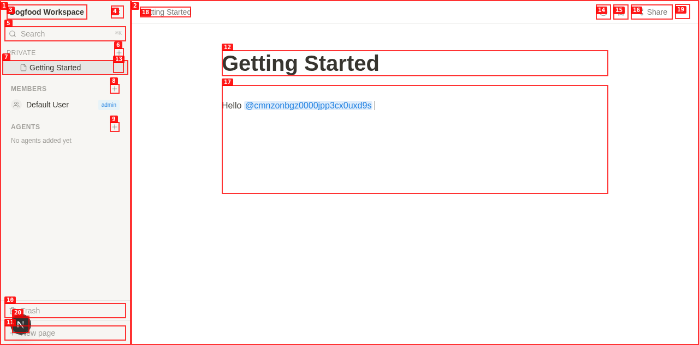

---

### ISSUE-004: "Publish to web" 활성화 후 공유 URL이 404 반환 (Critical)

| Field | Value |
|-------|-------|
| **Severity** | critical |
| **Category** | functional |
| **URL** | http://localhost:3010/share/{shareId} |
| **Repro Video** | N/A |

**Description**

Share 패널에서 "Publish" 스위치를 켜면 `http://localhost:3010/share/{shareId}` URL이 생성되고 "Anyone with the link can view"가 표시된다. 그러나 해당 URL로 이동하면 Next.js 기본 404 페이지("This page could not be found.")가 반환된다. Next.js App Router에 `/share/[shareId]` 라우트가 구현되지 않았다. userflow.md Step 7 "방법 A: Notion Share에서 직접 Publish"가 작동하지 않는다.

**Repro Steps**

1. 페이지에서 우측 상단 "Share" 버튼을 클릭한다.
   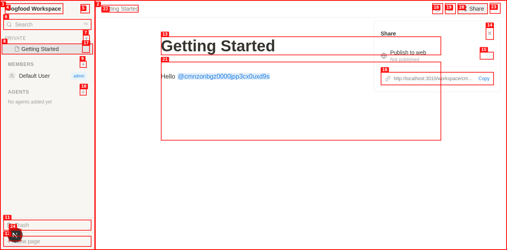

2. "Publish" 스위치를 클릭해 활성화한다. 공유 URL이 생성된다.
   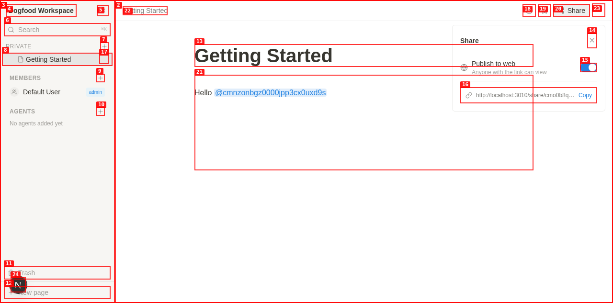

3. 생성된 공유 URL(`http://localhost:3010/share/...`)로 이동한다.

4. **Observe:** 404 "This page could not be found." 에러 페이지가 표시된다.
   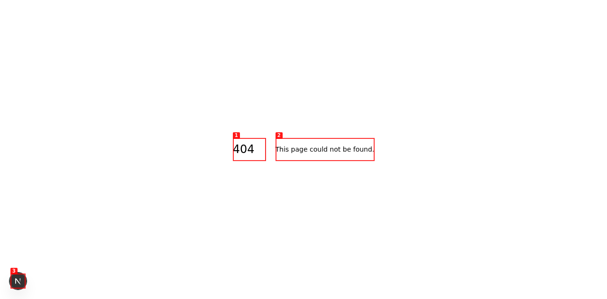

---

### ISSUE-005: 에디터 콘텐츠가 백엔드에 저장되지 않음

| Field | Value |
|-------|-------|
| **Severity** | high |
| **Category** | functional |
| **URL** | http://localhost:3010/workspace/{workspaceId}/{pageId} |
| **Repro Video** | N/A |

**Description**

에디터에 텍스트를 입력하고 다른 페이지로 이동했다가 돌아오면 입력한 내용이 사라진다. API를 직접 호출해 확인해도 page의 `content` 필드가 `{}` (빈 객체)로 남아 있다. Hocuspocus/Yjs를 통한 실시간 편집 이벤트가 PostgreSQL에 퍼시스트되지 않는 것으로 보인다.

**Repro Steps**

1. "Getting Started" 페이지를 열고 에디터에 텍스트를 입력한다 (예: "Hello @Default User").

2. 다른 URL (예: `/share/...`)로 이동했다가 `back` 버튼으로 돌아온다.

3. **Observe:** 입력한 텍스트가 사라지고 에디터가 빈 상태로 표시된다.

4. API 확인:
   ```
   GET http://localhost:3011/api/v1/pages/{pageId}
   → {"content": {}, ...}
   ```
   콘텐츠가 저장되지 않았음을 확인.

---

### ISSUE-006: 검색(Search)이 기존 페이지를 찾지 못함

| Field | Value |
|-------|-------|
| **Severity** | high |
| **Category** | functional |
| **URL** | http://localhost:3010/workspace/{workspaceId}/{pageId} |
| **Repro Video** | N/A |

**Description**

사이드바의 "Search pages (Cmd+K)" 버튼을 클릭해 검색 다이얼로그를 열고 "Getting"을 입력하면 "No pages found for 'Getting'"이 표시된다. "Getting Started" 페이지가 분명히 존재하는데도 검색 결과에 나타나지 않는다. Meilisearch 서버 자체는 실행 중 (`status: available`)이나 페이지 데이터가 인덱싱되지 않은 것으로 판단된다.

**Repro Steps**

1. 사이드바에서 "Search pages (Cmd+K)"를 클릭한다.

2. 검색 입력창에 "Getting"을 입력한다.

3. **Observe:** "No pages found for 'Getting'" 메시지가 나타난다. "Getting Started" 페이지가 표시되지 않는다.
   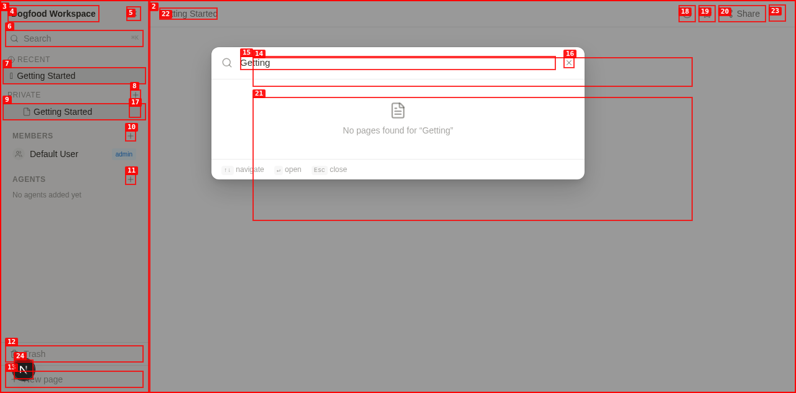

---

### ISSUE-007: 새 페이지 제목 편집 시 "Untitled"가 삭제되지 않고 중복 표시됨

| Field | Value |
|-------|-------|
| **Severity** | medium |
| **Category** | ux / functional |
| **URL** | http://localhost:3010/workspace/{workspaceId}/{pageId} |
| **Repro Video** | N/A |

**Description**

새 페이지를 생성하면 제목이 "Untitled"로 초기화된다. 제목 영역을 클릭하고 타이핑하면 기존 "Untitled" 텍스트가 교체되지 않고 입력한 텍스트와 "Untitled"가 동시에 두 줄로 표시된다 (예: 첫 줄 "Test Agent Mention Page", 두 번째 줄 "Untitled"). 사이드바와 상단 브레드크럼에도 "Test Agent Mention PageUntitled"처럼 연결된 형태로 표시된다. 에디터 포커스 시 기존 placeholder 텍스트가 clear되지 않는 버그로 추정된다.

**Repro Steps**

1. 사이드바에서 "New page"를 클릭한다.

2. 템플릿 선택 화면에서 "Blank page"를 클릭한다.

3. 제목 영역을 클릭하고 새 이름을 입력한다 (예: "My Test Page").

4. **Observe:** 제목이 "My Test Page" + "Untitled" 두 줄로 표시된다. 사이드바에도 "My Test PageUntitled"로 표시된다.
   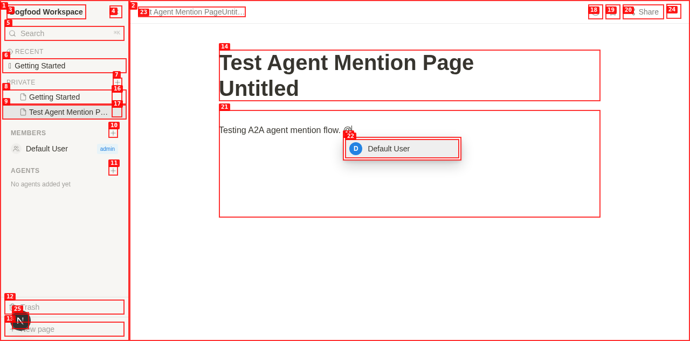

---

## 추가 관찰 사항 (이슈 미분류)

| 항목 | 설명 |
|------|------|
| **에이전트 등록 불가 (테스트 환경 한계)** | A2A 에이전트 URL 입력 시 외부 에이전트 서버가 없어 "Failed to fetch agent card"가 표시됨. 이는 테스트 환경 한계이며 UI 자체는 정상 동작. |
| **초대 모달에 이메일 입력 필드 없음** | userflow.md Step 2.2에 "이메일을 입력하고 초대 링크를 발송한다"고 명시되어 있으나, 구현은 링크 생성 방식만 지원. 이메일 발송 기능 미구현. |
| **Export as Markdown 피드백 없음** | "More actions > Export as Markdown" 클릭 시 성공/실패 토스트가 전혀 표시되지 않음. 다운로드가 시작되었는지 알 수 없음. |
| **A2A Human-in-the-loop 승인 배너 미구현** | userflow.md Step 7 "방법 B: A2A Human Approve로 Publish" 관련 UI (Publish Approval Request 배너)가 전혀 없음. |
| **MEMBERS 섹션에 초대 이메일 입력 기능 없음** | Notion 원본처럼 이메일 직접 입력 초대 기능이 없고 링크 방식만 존재. |

---

## 우선순위 요약

1. **즉시 수정 필요**
   - ISSUE-004: Share URL 404 (라우트 구현)
   - ISSUE-005: 에디터 콘텐츠 미저장 (Hocuspocus 퍼시스트 점검)

2. **다음 스프린트**
   - ISSUE-003: @멘션 ID 노출 (Tiptap mention label 수정)
   - ISSUE-006: 검색 인덱싱 (Meilisearch 연동 수정)
   - ISSUE-002: 초대 멤버 미표시 (invite 처리 로직 수정)

3. **개선 사항**
   - ISSUE-001: 인증 구현 (로그인 페이지)
   - ISSUE-007: 제목 편집 placeholder 동작 수정
